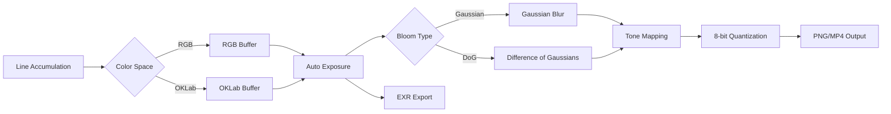

# Color Space & Rendering Upgrade Plan

This document outlines a systematic approach to implementing advanced color rendering features in the Three Body Problem visualization system. The plan is divided into **8 pull requests (PRs)** (numbered PR-0 through PR-7), each building upon the previous while maintaining a stable, visually appealing output at every step.

## Overview

### Goals
- Implement OKLab color space for perceptually uniform color blending
- Add HDR (High Dynamic Range) linear-light accumulation
- Introduce Difference-of-Gaussians (DoG) bloom for sharper, more defined glow effects
- Maintain backward compatibility and performance

### Principles
- Each PR should produce working, beautiful images
- New features are opt-in via CLI flags until proven stable
- Performance impact should be minimal (<20% for any single feature)
- Code should remain maintainable and well-documented

---

## PR-0: Infrastructure & Testing Framework

### Objective
Establish testing infrastructure and baseline references before making any visual changes.

### Implementation Details

#### 1. Add Profile Tagging System
```rust
// In Args struct (main.rs)
#[arg(long, default_value = "")]
profile_tag: String,  // Appended to output filenames

// Usage in filename generation
let output_file = format!("{}_{}_{}{}.png", 
    seed, steps, config, 
    if args.profile_tag.is_empty() { "" } else { format!("_{}", args.profile_tag) }
);
```

#### 2. Create Reference Image System
- Directory structure:
  ```
  ci/
  └── reference/
      ├── baseline_512x288.png
      ├── baseline_512x288.json
      └── generate_reference.sh
  ```

- Reference JSON format:
  ```json
  {
    "seed": "0x46205528",
    "width": 512,
    "height": 288,
    "num_steps": 100000,
    "drift_mode": "brownian",
    "drift_scale": 1.0,
    "alpha_compress": 6.0,
    "sha256": "abc123...",
    "timestamp": "2024-01-01T00:00:00Z"
  }
  ```

#### 3. CI Integration
- Add GitHub Actions workflow:
  ```yaml
  - name: Generate test image
    run: |
      cargo build --release
      ./target/release/three_body_problem \
        --seed 0x46205528 \
        --width 512 --height 288 \
        --num-steps-sim 100000 \
        --file-name ci_test
  
  - name: Verify image hash
    run: |
      python3 ci/verify_reference.py pics/ci_test.png
  ```

#### 4. Add Benchmark Infrastructure
```rust
// utils.rs
pub struct RenderMetrics {
    pub frame_time_ms: f64,
    pub blur_time_ms: f64,
    pub peak_memory_mb: f64,
}

impl RenderMetrics {
    pub fn log(&self) {
        println!("Performance: frame={:.1}ms blur={:.1}ms peak_mem={:.1}MB",
            self.frame_time_ms, self.blur_time_ms, self.peak_memory_mb);
    }
}
```

### Testing
- Verify CI passes with existing code
- Ensure reference generation script works
- Confirm profile tags appear in filenames correctly

### Files Changed
- `src/main.rs` (add profile_tag)
- `ci/reference/*` (new files)
- `.github/workflows/test.yml` (new/updated)
- `src/utils.rs` (add metrics)

---

## PR-1: Difference-of-Gaussians Bloom

### Objective
Replace the current dual-pass Gaussian bloom with a more sophisticated DoG approach that creates sharper, more defined glows.

### Implementation Details

#### 1. Add Mipmap Generation
```rust
// render.rs
pub struct MipPyramid {
    levels: Vec<Vec<(f64, f64, f64, f64)>>,
    widths: Vec<usize>,
    heights: Vec<usize>,
}

impl MipPyramid {
    pub fn new(base: &[(f64, f64, f64, f64)], width: usize, height: usize, levels: usize) -> Self {
        let mut pyramid = MipPyramid {
            levels: vec![base.to_vec()],
            widths: vec![width],
            heights: vec![height],
        };
        
        for level in 1..levels {
            let prev_w = pyramid.widths[level - 1];
            let prev_h = pyramid.heights[level - 1];
            let new_w = (prev_w + 1) / 2;
            let new_h = (prev_h + 1) / 2;
            
            let mut downsampled = vec![(0.0, 0.0, 0.0, 0.0); new_w * new_h];
            
            // Box filter downsample (parallel)
            downsampled.par_iter_mut().enumerate().for_each(|(idx, pixel)| {
                let x = idx % new_w;
                let y = idx / new_w;
                
                // Sample 2x2 region from previous level
                let x0 = (x * 2).min(prev_w - 1);
                let x1 = ((x * 2) + 1).min(prev_w - 1);
                let y0 = (y * 2).min(prev_h - 1);
                let y1 = ((y * 2) + 1).min(prev_h - 1);
                
                let p00 = pyramid.levels[level - 1][y0 * prev_w + x0];
                let p01 = pyramid.levels[level - 1][y0 * prev_w + x1];
                let p10 = pyramid.levels[level - 1][y1 * prev_w + x0];
                let p11 = pyramid.levels[level - 1][y1 * prev_w + x1];
                
                *pixel = (
                    (p00.0 + p01.0 + p10.0 + p11.0) * 0.25,
                    (p00.1 + p01.1 + p10.1 + p11.1) * 0.25,
                    (p00.2 + p01.2 + p10.2 + p11.2) * 0.25,
                    (p00.3 + p01.3 + p10.3 + p11.3) * 0.25,
                );
            });
            
            pyramid.levels.push(downsampled);
            pyramid.widths.push(new_w);
            pyramid.heights.push(new_h);
        }
        
        pyramid
    }
    
    pub fn upsample_bilinear(&self, level: usize, target_w: usize, target_h: usize) -> Vec<(f64, f64, f64, f64)> {
        let src = &self.levels[level];
        let src_w = self.widths[level];
        let src_h = self.heights[level];
        let mut result = vec![(0.0, 0.0, 0.0, 0.0); target_w * target_h];
        
        result.par_iter_mut().enumerate().for_each(|(idx, pixel)| {
            let x = idx % target_w;
            let y = idx / target_w;
            
            // Map to source coordinates
            let sx = (x as f64 * src_w as f64 / target_w as f64).min((src_w - 1) as f64);
            let sy = (y as f64 * src_h as f64 / target_h as f64).min((src_h - 1) as f64);
            
            let x0 = sx.floor() as usize;
            let y0 = sy.floor() as usize;
            let x1 = (x0 + 1).min(src_w - 1);
            let y1 = (y0 + 1).min(src_h - 1);
            
            let fx = sx - x0 as f64;
            let fy = sy - y0 as f64;
            
            // Bilinear interpolation
            let p00 = src[y0 * src_w + x0];
            let p01 = src[y0 * src_w + x1];
            let p10 = src[y1 * src_w + x0];
            let p11 = src[y1 * src_w + x1];
            
            let top = (
                p00.0 * (1.0 - fx) + p01.0 * fx,
                p00.1 * (1.0 - fx) + p01.1 * fx,
                p00.2 * (1.0 - fx) + p01.2 * fx,
                p00.3 * (1.0 - fx) + p01.3 * fx,
            );
            
            let bottom = (
                p10.0 * (1.0 - fx) + p11.0 * fx,
                p10.1 * (1.0 - fx) + p11.1 * fx,
                p10.2 * (1.0 - fx) + p11.2 * fx,
                p10.3 * (1.0 - fx) + p11.3 * fx,
            );
            
            *pixel = (
                top.0 * (1.0 - fy) + bottom.0 * fy,
                top.1 * (1.0 - fy) + bottom.1 * fy,
                top.2 * (1.0 - fy) + bottom.2 * fy,
                top.3 * (1.0 - fy) + bottom.3 * fy,
            );
        });
        
        result
    }
}
```

#### 2. Implement DoG Bloom
```rust
// render.rs
pub struct DogBloomConfig {
    pub inner_sigma: f64,   // Base blur radius
    pub outer_ratio: f64,   // Outer sigma = inner * ratio (typically 2-3)
    pub strength: f64,      // DoG multiplier (0.2-0.8)
    pub threshold: f64,     // Minimum value to include
}

impl Default for DogBloomConfig {
    fn default() -> Self {
        Self {
            inner_sigma: 6.0,
            outer_ratio: 2.5,
            strength: 0.35,
            threshold: 0.01,
        }
    }
}

pub fn apply_dog_bloom(
    input: &[(f64, f64, f64, f64)],
    width: usize,
    height: usize,
    config: &DogBloomConfig,
) -> Vec<(f64, f64, f64, f64)> {
    // Create mip pyramid (3 levels)
    let pyramid = MipPyramid::new(input, width, height, 3);
    
    // Blur at different mip levels for efficiency
    let inner_radius = config.inner_sigma.round() as usize;
    let outer_radius = (config.inner_sigma * config.outer_ratio).round() as usize;
    
    // Blur level 1 (half resolution) with inner sigma
    let mut blur_inner = pyramid.levels[1].clone();
    parallel_blur_2d_rgba(
        &mut blur_inner,
        pyramid.widths[1],
        pyramid.heights[1],
        inner_radius / 2,  // Adjust for mip level
    );
    
    // Blur level 2 (quarter resolution) with outer sigma
    let mut blur_outer = pyramid.levels[2].clone();
    parallel_blur_2d_rgba(
        &mut blur_outer,
        pyramid.widths[2],
        pyramid.heights[2],
        outer_radius / 4,  // Adjust for mip level
    );
    
    // Upsample both to original resolution
    let inner_upsampled = pyramid.upsample_bilinear(1, width, height);
    let outer_upsampled = pyramid.upsample_bilinear(2, width, height);
    
    // Compute DoG and apply threshold
    let mut dog_result = vec![(0.0, 0.0, 0.0, 0.0); width * height];
    
    dog_result.par_iter_mut()
        .zip(inner_upsampled.par_iter())
        .zip(outer_upsampled.par_iter())
        .for_each(|((dog, &inner), &outer)| {
            let diff = (
                inner.0 - outer.0,
                inner.1 - outer.1,
                inner.2 - outer.2,
                inner.3 - outer.3,
            );
            
            // Compute luminance for thresholding
            let lum = 0.299 * diff.0 + 0.587 * diff.1 + 0.114 * diff.2;
            
            if lum > config.threshold {
                *dog = (
                    diff.0 * config.strength,
                    diff.1 * config.strength,
                    diff.2 * config.strength,
                    diff.3 * config.strength,
                );
            }
            // Negative values are left as zero (clamped)
        });
    
    dog_result
}
```

#### 3. Update CLI Arguments
```rust
// main.rs
#[derive(Parser, Debug)]
struct Args {
    // ... existing args ...
    
    /// Bloom mode: gaussian or dog
    #[arg(long, default_value = "gaussian")]
    bloom_mode: String,
    
    /// DoG bloom strength (0.1-1.0)
    #[arg(long, default_value_t = 0.35)]
    dog_strength: f64,
    
    /// DoG inner sigma in pixels
    #[arg(long, default_value_t = 6.0)]
    dog_sigma: f64,
    
    /// DoG outer/inner sigma ratio
    #[arg(long, default_value_t = 2.5)]
    dog_ratio: f64,
}
```

#### 4. Integrate into Render Pipeline
```rust
// In pass_2_write_frames_spectral
if args.bloom_mode == "dog" {
    let dog_config = DogBloomConfig {
        inner_sigma: args.dog_sigma,
        outer_ratio: args.dog_ratio,
        strength: args.dog_strength,
        threshold: 0.01,
    };
    
    let dog_bloom = apply_dog_bloom(&final_frame_pixels, width, height, &dog_config);
    
    // Add DoG to final frame
    final_frame_pixels.par_iter_mut()
        .zip(dog_bloom.par_iter())
        .for_each(|(pixel, &dog)| {
            pixel.0 = (pixel.0 + dog.0).min(1.0);
            pixel.1 = (pixel.1 + dog.1).min(1.0);
            pixel.2 = (pixel.2 + dog.2).min(1.0);
            // Alpha unchanged
        });
} else {
    // Existing Gaussian bloom code
}
```

### Testing
- Compare visual output: `--bloom-mode gaussian` vs `--bloom-mode dog`
- Verify performance impact < 10% on 1080p frames
- Test parameter ranges: vary dog_strength from 0.1 to 1.0
- Add new reference image with DoG enabled

### Expected Visual Changes
- Sharper bloom edges
- Less "foggy" appearance
- Enhanced visibility of individual paths
- More dramatic light-to-dark transitions

### Files Changed
- `src/render.rs` (add MipPyramid, DogBloomConfig, apply_dog_bloom)
- `src/main.rs` (add bloom CLI args)
- `ci/reference/` (add dog_bloom reference)

---

## PR-2: Auto-Exposed Linear-Light HDR

### Objective
Implement true HDR accumulation with automatic exposure adjustment for optimal dynamic range.

### Implementation Details

#### 1. Remove Alpha Compression
```rust
// render.rs
// In plot() and plot_spec() functions

// OLD CODE (remove):
// let k = get_alpha_compress();
// if k > 0.0 {
//     src_alpha = 1.0 - (-k * src_alpha).exp();
// }

// NEW CODE:
let hdr_scale = get_hdr_scale(); // New global parameter
let src_alpha = (alpha as f64 * base_alpha * hdr_scale).clamp(0.0, f64::MAX);
```

#### 2. Add HDR Scale Management
```rust
// render.rs
static HDR_SCALE: AtomicU64 = AtomicU64::new(1.0f64.to_bits());

pub fn set_hdr_scale(scale: f64) {
    HDR_SCALE.store(scale.to_bits(), Ordering::Relaxed);
}

pub fn get_hdr_scale() -> f64 {
    f64::from_bits(HDR_SCALE.load(Ordering::Relaxed))
}
```

#### 3. Implement Auto-Exposure System
```rust
// render.rs
pub struct ExposureCalculator {
    histogram_bins: usize,
    target_percentile: f64,
    min_exposure: f64,
    max_exposure: f64,
}

impl Default for ExposureCalculator {
    fn default() -> Self {
        Self {
            histogram_bins: 256,
            target_percentile: 0.95,
            min_exposure: 0.1,
            max_exposure: 10.0,
        }
    }
}

impl ExposureCalculator {
    pub fn calculate_exposure(&self, pixels: &[(f64, f64, f64, f64)]) -> f64 {
        // Compute luminance values
        let luminances: Vec<f64> = pixels
            .par_iter()
            .map(|(r, g, b, a)| {
                // Rec. 709 luminance weights
                let lum = 0.2126 * r + 0.7152 * g + 0.0722 * b;
                lum * a  // Premultiplied
            })
            .filter(|&l| l > 0.0)  // Ignore black pixels
            .collect();
        
        if luminances.is_empty() {
            return 1.0;
        }
        
        // Find percentile using partial sort
        let mut sorted = luminances;
        let percentile_idx = ((sorted.len() as f64 * self.target_percentile) as usize)
            .min(sorted.len() - 1);
        
        sorted.select_nth_unstable(percentile_idx);
        let percentile_value = sorted[percentile_idx];
        
        // Calculate exposure to map percentile to ~0.8
        let exposure = 0.8 / percentile_value.max(1e-10);
        
        // Clamp to reasonable range
        exposure.clamp(self.min_exposure, self.max_exposure)
    }
}

// Add exposure field to frame processing
pub struct FrameMetadata {
    pub step: usize,
    pub exposure: f64,
    pub avg_luminance: f64,
    pub peak_luminance: f64,
}
```

#### 4. Keep f64 Precision
We maintain f64 throughout the pipeline for maximum precision, as the performance difference is minimal and quality is paramount.

#### 5. Update Render Pipeline
```rust
// In pass_2_write_frames_spectral
let exposure_calc = ExposureCalculator::default();
let auto_exposure = if args.hdr_mode == "auto" {
    exposure_calc.calculate_exposure(&final_frame_pixels)
} else {
    1.0  // No exposure adjustment
};

// Apply exposure before tonemapping
final_frame_pixels.par_iter_mut().for_each(|pix| {
    pix.0 *= auto_exposure;
    pix.1 *= auto_exposure;
    pix.2 *= auto_exposure;
    // Alpha unchanged
});

// Log exposure for debugging
if step % frame_interval == 0 {
    println!("Frame {}: auto_exposure = {:.3}", step / frame_interval, auto_exposure);
}
```

#### 6. Update CLI
```rust
// main.rs
#[arg(long, default_value = "off")]
hdr_mode: String,  // "off" or "auto"

#[arg(long, default_value_t = 0.15)]
hdr_scale: f64,  // Multiplier for line alpha in HDR mode
```

### Testing
- Render same scene with `--hdr-mode off` vs `--hdr-mode auto`
- Verify no pixel values exceed reasonable bounds before tonemapping
- Test with very sparse (few lines) and very dense (many overlapping lines) scenes
- Verify performance with f64 precision throughout
- Add HDR reference image

### Expected Visual Changes
- Brighter line cores without losing detail
- Better visibility in both dark and bright regions
- More "luminous" appearance overall
- Possible slight color shift due to different accumulation

### Files Changed
- `src/render.rs` (remove compression, add exposure calc)
- `src/main.rs` (add HDR CLI args)
- `src/spectrum.rs` (no changes needed)
- `ci/reference/` (add HDR reference)

---

## PR-3: Post-Effects Pipeline Refactor

### Objective
Create a modular post-processing pipeline to support future effects without code duplication.

### Implementation Details

#### 1. Define Post-Effect Traits
```rust
// post_effects.rs (new file)
use std::error::Error;

pub type PixelBuffer = Vec<(f64, f64, f64, f64)>;

pub trait PostEffect: Send + Sync {
    fn name(&self) -> &str;
    fn process(&self, input: &PixelBuffer, width: usize, height: usize) -> Result<PixelBuffer, Box<dyn Error>>;
    fn is_enabled(&self) -> bool { true }
}

pub struct PostEffectChain {
    effects: Vec<Box<dyn PostEffect>>,
}

impl PostEffectChain {
    pub fn new() -> Self {
        Self { effects: Vec::new() }
    }
    
    pub fn add(&mut self, effect: Box<dyn PostEffect>) {
        self.effects.push(effect);
    }
    
    pub fn process(&self, mut buffer: PixelBuffer, width: usize, height: usize) -> Result<PixelBuffer, Box<dyn Error>> {
        for effect in &self.effects {
            if effect.is_enabled() {
                println!("Applying post-effect: {}", effect.name());
                buffer = effect.process(&buffer, width, height)?;
            }
        }
        Ok(buffer)
    }
}
```

#### 2. Implement Existing Effects as Modules
```rust
// post_effects/gaussian_bloom.rs
pub struct GaussianBloom {
    pub radius: usize,
    pub strength: f64,
    pub core_brightness: f64,
    pub enabled: bool,
}

impl PostEffect for GaussianBloom {
    fn name(&self) -> &str { "Gaussian Bloom" }
    
    fn is_enabled(&self) -> bool { self.enabled }
    
    fn process(&self, input: &PixelBuffer, width: usize, height: usize) -> Result<PixelBuffer, Box<dyn Error>> {
        let mut blurred = input.clone();
        parallel_blur_2d_rgba(&mut blurred, width, height, self.radius);
        
        let mut output = input.clone();
        output.par_iter_mut()
            .zip(input.par_iter())
            .zip(blurred.par_iter())
            .for_each(|((out, &base), &blur)| {
                // Screen blend
                let r = base.0 * self.core_brightness + blur.0 * self.strength;
                let g = base.1 * self.core_brightness + blur.1 * self.strength;
                let b = base.2 * self.core_brightness + blur.2 * self.strength;
                let a = base.3;
                
                *out = (r, g, b, a);
            });
        
        Ok(output)
    }
}

// post_effects/dog_bloom.rs
pub struct DogBloom {
    pub config: DogBloomConfig,
    pub enabled: bool,
}

impl PostEffect for DogBloom {
    fn name(&self) -> &str { "DoG Bloom" }
    
    fn is_enabled(&self) -> bool { self.enabled }
    
    fn process(&self, input: &PixelBuffer, width: usize, height: usize) -> Result<PixelBuffer, Box<dyn Error>> {
        // Convert existing apply_dog_bloom to work with trait interface
        let dog = apply_dog_bloom(input, width, height, &self.config);
        
        let mut output = input.clone();
        output.par_iter_mut()
            .zip(dog.par_iter())
            .for_each(|(out, &add)| {
                out.0 = (out.0 + add.0).min(f64::MAX);
                out.1 = (out.1 + add.1).min(f64::MAX);
                out.2 = (out.2 + add.2).min(f64::MAX);
            });
        
        Ok(output)
    }
}

// post_effects/exposure.rs
pub struct AutoExposure {
    pub calculator: ExposureCalculator,
    pub enabled: bool,
}

impl PostEffect for AutoExposure {
    fn name(&self) -> &str { "Auto Exposure" }
    
    fn is_enabled(&self) -> bool { self.enabled }
    
    fn process(&self, input: &PixelBuffer, width: usize, height: usize) -> Result<PixelBuffer, Box<dyn Error>> {
        let exposure = self.calculator.calculate_exposure(input);
        
        let mut output = input.clone();
        output.par_iter_mut().for_each(|pix| {
            pix.0 *= exposure;
            pix.1 *= exposure;
            pix.2 *= exposure;
        });
        
        Ok(output)
    }
}

// post_effects/tonemap.rs
pub struct AcesTonemap {
    pub enabled: bool,
}

impl PostEffect for AcesTonemap {
    fn name(&self) -> &str { "ACES Tonemap" }
    
    fn is_enabled(&self) -> bool { self.enabled }
    
    fn process(&self, input: &PixelBuffer, width: usize, height: usize) -> Result<PixelBuffer, Box<dyn Error>> {
        let mut output = input.clone();
        output.par_iter_mut().for_each(|pix| {
            pix.0 = aces_film(pix.0);
            pix.1 = aces_film(pix.1);
            pix.2 = aces_film(pix.2);
        });
        
        Ok(output)
    }
}
```

#### 3. Create Pipeline Factory
```rust
// render.rs
pub fn create_post_effect_chain(args: &Args) -> PostEffectChain {
    let mut chain = PostEffectChain::new();
    
    // Add effects in order
    
    // 1. Exposure
    if args.hdr_mode == "auto" {
        chain.add(Box::new(AutoExposure {
            calculator: ExposureCalculator::default(),
            enabled: true,
        }));
    }
    
    // 2. Bloom
    match args.bloom_mode.as_str() {
        "gaussian" => {
            chain.add(Box::new(GaussianBloom {
                radius: args.blur_radius_px,
                strength: args.blur_strength,
                core_brightness: args.blur_core_brightness,
                enabled: true,
            }));
        }
        "dog" => {
            chain.add(Box::new(DogBloom {
                config: DogBloomConfig {
                    inner_sigma: args.dog_sigma,
                    outer_ratio: args.dog_ratio,
                    strength: args.dog_strength,
                    threshold: 0.01,
                },
                enabled: true,
            }));
        }
        _ => {}
    }
    
    // 3. Tonemap (always last)
    chain.add(Box::new(AcesTonemap { enabled: true }));
    
    chain
}
```

#### 4. Update Render Loop
```rust
// In pass_2_write_frames_spectral
let post_chain = create_post_effect_chain(&args);

// After accumulating frame
if (step > 0 && step % frame_interval == 0) || is_final {
    // Convert SPD to RGBA
    convert_spd_buffer_to_rgba(&accum_spd, &mut accum_rgba);
    
    // Run post-effect chain
    let processed = post_chain.process(accum_rgba.clone(), width, height)?;
    
    // Convert to 8-bit with levels adjustment
    // ... existing 8-bit conversion code ...
}
```

### Testing
- Verify output is pixel-identical to PR-2
- Benchmark overhead of trait dispatch (should be < 1%)
- Test disabling individual effects
- Ensure error handling works properly

### Files Changed
- `src/post_effects/mod.rs` (new)
- `src/post_effects/gaussian_bloom.rs` (new)
- `src/post_effects/dog_bloom.rs` (new)
- `src/post_effects/exposure.rs` (new)
- `src/post_effects/tonemap.rs` (new)
- `src/render.rs` (refactor to use pipeline)
- `src/main.rs` (add mod post_effects)

---

## PR-4: OKLab Perceptual Blur

### Objective
Add OKLab color space conversion for blur operations only, improving color mixing without changing the core accumulation logic.

### Implementation Details

#### 1. Create OKLab Module
```rust
// oklab.rs (new file)
use rayon::prelude::*;

/// Convert linear sRGB to OKLab
/// Input: linear RGB values (not gamma corrected)
/// Output: L (lightness), a (green-red), b (blue-yellow)
#[inline]
pub fn linear_srgb_to_oklab(r: f64, g: f64, b: f64) -> (f64, f64, f64) {
    // Matrix multiplication: RGB to LMS
    let l = 0.4122214708 * r + 0.5363325363 * g + 0.0514459929 * b;
    let m = 0.2119034982 * r + 0.6806995451 * g + 0.1073969566 * b;
    let s = 0.0883024619 * r + 0.2817188376 * g + 0.6299787005 * b;
    
    // Apply cube root
    let l_cbrt = l.cbrt();
    let m_cbrt = m.cbrt();
    let s_cbrt = s.cbrt();
    
    // Transform to Lab
    let lab_l = 0.2104542553 * l_cbrt + 0.7936177850 * m_cbrt - 0.0040720468 * s_cbrt;
    let lab_a = 1.9779984951 * l_cbrt - 2.4285922050 * m_cbrt + 0.4505937099 * s_cbrt;
    let lab_b = 0.0259040371 * l_cbrt + 0.7827717662 * m_cbrt - 0.8086757660 * s_cbrt;
    
    (lab_l, lab_a, lab_b)
}

/// Convert OKLab to linear sRGB
#[inline]
pub fn oklab_to_linear_srgb(l: f64, a: f64, b: f64) -> (f64, f64, f64) {
    // Transform from Lab to LMS (cube root space)
    let l_cbrt = l + 0.3963377774 * a + 0.2158037573 * b;
    let m_cbrt = l - 0.1055613458 * a - 0.0638541728 * b;
    let s_cbrt = l - 0.0894841775 * a - 1.2914855480 * b;
    
    // Cube to get LMS
    let l_lms = l_cbrt * l_cbrt * l_cbrt;
    let m_lms = m_cbrt * m_cbrt * m_cbrt;
    let s_lms = s_cbrt * s_cbrt * s_cbrt;
    
    // Transform to linear sRGB
    let r = 4.0767416621 * l_lms - 3.3077115913 * m_lms + 0.2309699292 * s_lms;
    let g = -1.2684380046 * l_lms + 2.6097574011 * m_lms - 0.3413193965 * s_lms;
    let b = -0.0041960863 * l_lms - 0.7034186147 * m_lms + 1.7076147010 * s_lms;
    
    (r, g, b)
}

/// SIMD-optimized batch conversion
pub fn linear_srgb_to_oklab_batch(pixels: &[(f64, f64, f64, f64)]) -> Vec<(f64, f64, f64, f64)> {
    pixels.par_iter()
        .map(|&(r, g, b, a)| {
            let (l, a_ch, b_ch) = linear_srgb_to_oklab(r, g, b);
            (l, a_ch, b_ch, a)
        })
        .collect()
}

pub fn oklab_to_linear_srgb_batch(pixels: &[(f64, f64, f64, f64)]) -> Vec<(f64, f64, f64, f64)> {
    pixels.par_iter()
        .map(|&(l, a_ch, b_ch, alpha)| {
            let (r, g, b) = oklab_to_linear_srgb(l, a_ch, b_ch);
            (r, g, b, alpha)
        })
        .collect()
}

/// Soft gamut mapping for out-of-gamut colors
#[inline]
pub fn soft_clip_rgb(r: f64, g: f64, b: f64) -> (f64, f64, f64) {
    // Find how far out of gamut we are
    let min_val = r.min(g).min(b);
    let max_val = r.max(g).max(b);
    
    if min_val >= 0.0 && max_val <= 1.0 {
        return (r, g, b);  // Already in gamut
    }
    
    // Preserve hue by scaling towards gray
    let lum = 0.2126 * r + 0.7152 * g + 0.0722 * b;
    
    // Calculate scale factor to bring into gamut
    let scale = if min_val < 0.0 {
        lum / (lum - min_val)
    } else {
        (1.0 - lum) / (max_val - lum)
    };
    
    let scale = scale.clamp(0.0, 1.0);
    
    (
        lum + (r - lum) * scale,
        lum + (g - lum) * scale,
        lum + (b - lum) * scale,
    )
}
```

#### 2. Create Perceptual Blur Post-Effect
```rust
// post_effects/perceptual_blur.rs
use crate::oklab::*;

pub struct PerceptualBlur {
    pub radius: usize,
    pub strength: f64,
    pub enabled: bool,
}

impl PostEffect for PerceptualBlur {
    fn name(&self) -> &str { "Perceptual Blur (OKLab)" }
    
    fn is_enabled(&self) -> bool { self.enabled }
    
    fn process(&self, input: &PixelBuffer, width: usize, height: usize) -> Result<PixelBuffer, Box<dyn Error>> {
        // Convert to OKLab
        let oklab_buffer = linear_srgb_to_oklab_batch(input);
        
        // Apply blur in OKLab space
        let mut blurred_oklab = oklab_buffer.clone();
        parallel_blur_2d_rgba(&mut blurred_oklab, width, height, self.radius);
        
        // Convert back to RGB
        let mut blurred_rgb = oklab_to_linear_srgb_batch(&blurred_oklab);
        
        // Apply gamut mapping
        blurred_rgb.par_iter_mut().for_each(|pixel| {
            let (r, g, b) = soft_clip_rgb(pixel.0, pixel.1, pixel.2);
            pixel.0 = r;
            pixel.1 = g;
            pixel.2 = b;
        });
        
        // Blend with original
        let mut output = input.clone();
        output.par_iter_mut()
            .zip(input.par_iter())
            .zip(blurred_rgb.par_iter())
            .for_each(|((out, &orig), &blur)| {
                out.0 = orig.0 + blur.0 * self.strength;
                out.1 = orig.1 + blur.1 * self.strength;
                out.2 = orig.2 + blur.2 * self.strength;
                out.3 = orig.3;  // Preserve alpha
            });
        
        Ok(output)
    }
}
```

#### 3. Add Color Space Tests
```rust
// oklab.rs (tests module)
#[cfg(test)]
mod tests {
    use super::*;
    
    #[test]
    fn test_rgb_oklab_roundtrip() {
        let test_colors = [
            (0.0, 0.0, 0.0),    // Black
            (1.0, 1.0, 1.0),    // White
            (1.0, 0.0, 0.0),    // Red
            (0.0, 1.0, 0.0),    // Green
            (0.0, 0.0, 1.0),    // Blue
            (0.5, 0.5, 0.5),    // Gray
        ];
        
        for (r, g, b) in &test_colors {
            let (l, a, b_ch) = linear_srgb_to_oklab(*r, *g, *b);
            let (r2, g2, b2) = oklab_to_linear_srgb(l, a, b_ch);
            
            assert!((r - r2).abs() < 0.001, "R mismatch for ({}, {}, {})", r, g, b);
            assert!((g - g2).abs() < 0.001, "G mismatch for ({}, {}, {})", r, g, b);
            assert!((b - b2).abs() < 0.001, "B mismatch for ({}, {}, {})", r, g, b);
        }
    }
    
    #[test]
    fn test_perceptual_uniformity() {
        // Test that equal steps in Lab space produce perceptually uniform changes
        let base_color = linear_srgb_to_oklab(0.5, 0.5, 0.5);
        let step = 0.1;
        
        for i in -5..=5 {
            let l_adjusted = base_color.0 + (i as f64) * step;
            let (r, g, b) = oklab_to_linear_srgb(l_adjusted, base_color.1, base_color.2);
            println!("L offset {}: RGB({:.3}, {:.3}, {:.3})", i as f64 * step, r, g, b);
        }
    }
}
```

#### 4. Update CLI and Pipeline
```rust
// main.rs
#[arg(long, default_value = "off")]
perceptual_blur: String,  // "on" or "off"

// In create_post_effect_chain
if args.perceptual_blur == "on" {
    chain.add(Box::new(PerceptualBlur {
        radius: args.blur_radius_px,
        strength: 0.5,  // Lower strength for perceptual blur
        enabled: true,
    }));
}
```

### Testing
- Visual comparison: standard blur vs perceptual blur on colorful scenes
- Verify gamut mapping prevents invalid RGB values
- Performance: should be < 20% slower than RGB blur
- Test with high-saturation colors to see preservation
- Add perceptual blur reference image

### Expected Visual Changes
- More saturated blur halos
- Better color preservation at path intersections
- Smoother color transitions
- Potentially more "rainbow" effects at bright intersections

### Files Changed
- `src/oklab.rs` (new)
- `src/post_effects/perceptual_blur.rs` (new)
- `src/post_effects/mod.rs` (add module)
- `src/main.rs` (add CLI flag)
- `ci/reference/` (add perceptual blur reference)

---

## PR-5: Full OKLab Accumulation

### Objective
Optionally perform all color accumulation in OKLab space for maximum color quality.

### Implementation Details

#### 1. Add Draw Space Configuration
```rust
// render.rs
#[derive(Debug, Clone, Copy)]
pub enum DrawSpace {
    LinearRgb,
    Oklab,
}

static DRAW_SPACE: AtomicU8 = AtomicU8::new(0);

pub fn set_draw_space(space: DrawSpace) {
    let value = match space {
        DrawSpace::LinearRgb => 0,
        DrawSpace::Oklab => 1,
    };
    DRAW_SPACE.store(value, Ordering::Relaxed);
}

pub fn get_draw_space() -> DrawSpace {
    match DRAW_SPACE.load(Ordering::Relaxed) {
        1 => DrawSpace::Oklab,
        _ => DrawSpace::LinearRgb,
    }
}
```

#### 2. Update Plot Functions
```rust
// render.rs
#[inline]
fn plot(
    accum: &mut [(f64,f64,f64,f64)], 
    width: u32, 
    height: u32,
    x: i32, 
    y: i32, 
    alpha: f64,
    color_r: f64, 
    color_g: f64, 
    color_b: f64, 
    base_alpha: f64
) {
    if x >= 0 && x < width as i32 && y >= 0 && y < height as i32 {
        let idx = (y as usize * width as usize) + x as usize;
        
        let hdr_scale = get_hdr_scale();
        let src_alpha = (alpha * base_alpha * hdr_scale).clamp(0.0, f64::MAX);
        
        match get_draw_space() {
            DrawSpace::LinearRgb => {
                // Existing RGB blending code
                let (dst_r, dst_g, dst_b, dst_alpha) = accum[idx];
                
                let src_r_pre = color_r * src_alpha;
                let src_g_pre = color_g * src_alpha;
                let src_b_pre = color_b * src_alpha;
                
                let out_r = src_r_pre + dst_r * (1.0 - src_alpha);
                let out_g = src_g_pre + dst_g * (1.0 - src_alpha);
                let out_b = src_b_pre + dst_b * (1.0 - src_alpha);
                let out_alpha = src_alpha + dst_alpha * (1.0 - src_alpha);
                
                accum[idx] = (out_r, out_g, out_b, out_alpha);
            }
            DrawSpace::Oklab => {
                // Convert source color to OKLab
                let (src_l, src_a, src_b) = linear_srgb_to_oklab(color_r, color_g, color_b);
                
                let (dst_l, dst_a, dst_b, dst_alpha) = accum[idx];
                
                // Premultiply in OKLab space
                let src_l_pre = src_l * src_alpha;
                let src_a_pre = src_a * src_alpha;
                let src_b_pre = src_b * src_alpha;
                
                // Over blending in OKLab
                let out_l = src_l_pre + dst_l * (1.0 - src_alpha);
                let out_a = src_a_pre + dst_a * (1.0 - src_alpha);
                let out_b = src_b_pre + dst_b * (1.0 - src_alpha);
                let out_alpha = src_alpha + dst_alpha * (1.0 - src_alpha);
                
                accum[idx] = (out_l, out_a, out_b, out_alpha);
            }
        }
    }
}
```

#### 3. Update Color Generation
```rust
// render.rs
pub fn generate_color_gradient_oklab(
    rng: &mut sim::Sha3RandomByteStream, 
    length: usize,
    body_index: usize,
    base_hue_offset: f64,
) -> Vec<(f64, f64, f64)> {
    let mut colors = Vec::with_capacity(length);
    
    // Start in LCH space for intuitive control
    let mut hue = rng.next_f64() * 360.0;
    hue += body_index as f64 * 120.0;
    
    let base_chroma = 0.15;  // OKLab chroma range is ~0-0.3
    let chroma_range = 0.10;
    let base_lightness = 0.6;
    let lightness_range = 0.3;
    
    for step in 0..length {
        // Time-based hue drift
        let time_drift = if step > 0 {
            base_hue_offset * (1.0 + (step as f64).ln()).min(360.0)
        } else {
            0.0
        };
        
        let current_hue = (hue + time_drift).rem_euclid(360.0);
        
        // Random variation
        let chroma = base_chroma + rng.next_f64() * chroma_range;
        let lightness = base_lightness + rng.next_f64() * lightness_range;
        
        // Convert LCH to Lab
        let hue_rad = current_hue.to_radians();
        let a = chroma * hue_rad.cos();
        let b = chroma * hue_rad.sin();
        
        // Store as OKLab for direct use
        colors.push((lightness, a, b));
    }
    
    colors
}
```

#### 4. Update Conversion Pipeline
```rust
// render.rs
fn convert_buffer_to_output_space(
    buffer: &[(f64, f64, f64, f64)],
    draw_space: DrawSpace,
) -> Vec<(f64, f64, f64, f64)> {
    match draw_space {
        DrawSpace::LinearRgb => buffer.to_vec(),
        DrawSpace::Oklab => {
            // Convert from OKLab to RGB for final output
            buffer.par_iter()
                .map(|&(l, a, b, alpha)| {
                    let (r, g, b_rgb) = oklab_to_linear_srgb(l, a, b);
                    let (r_clip, g_clip, b_clip) = soft_clip_rgb(r, g, b_rgb);
                    (r_clip, g_clip, b_clip, alpha)
                })
                .collect()
        }
    }
}
```

#### 5. Update Spectral Path
```rust
// Note: Keep spectral path in RGB space to avoid double conversion
// Add comment explaining this decision
```

#### 6. Update CLI
```rust
// main.rs
#[arg(long, default_value = "rgb")]
draw_space: String,  // "rgb" or "oklab"

// In main()
let draw_space = match args.draw_space.as_str() {
    "oklab" => DrawSpace::Oklab,
    _ => DrawSpace::LinearRgb,
};
set_draw_space(draw_space);
```

### Testing
- A/B comparison: identical seed with RGB vs OKLab accumulation
- Verify no NaN/Inf values in OKLab buffers
- Performance: target < 20% slowdown
- Test with extreme colors (very saturated, very bright)
- Memory usage should remain the same
- Add OKLab accumulation reference

### Expected Visual Changes
- Even better color preservation than perceptual blur alone
- Potentially different color mixing behavior
- May see unexpected colors due to OKLab's different gamut
- Highlights might have different hues

### Files Changed
- `src/render.rs` (add DrawSpace, update plot, color generation)
- `src/main.rs` (add draw-space CLI)
- `ci/reference/` (add OKLab reference)

---

## PR-6: Quality Presets & Tuning

### Objective
Simplify user experience by providing curated presets for common use cases.

### Implementation Details

#### 1. Define Preset System
```rust
// presets.rs (new file)
use crate::post_effects::*;
use crate::render::DrawSpace;

#[derive(Debug, Clone)]
pub struct RenderPreset {
    pub name: &'static str,
    pub description: &'static str,
    
    // Bloom settings
    pub bloom_mode: &'static str,
    pub blur_radius_scale: f64,  // Multiplier for auto-calculated radius
    pub blur_strength: f64,
    pub blur_core_brightness: f64,
    
    // DoG settings
    pub dog_sigma_scale: f64,
    pub dog_ratio: f64,
    pub dog_strength: f64,
    
    // HDR settings
    pub hdr_mode: &'static str,
    pub hdr_scale: f64,
    
    // Color settings
    pub draw_space: DrawSpace,
    pub perceptual_blur: bool,
    
    // Performance
    pub target_fps: Option<u32>,
}

impl RenderPreset {
    pub fn soft() -> Self {
        Self {
            name: "soft",
            description: "Gentle glow, pastel colors, suitable for prints",
            bloom_mode: "gaussian",
            blur_radius_scale: 0.8,
            blur_strength: 6.0,
            blur_core_brightness: 8.0,
            dog_sigma_scale: 0.0,  // Not used
            dog_ratio: 0.0,
            dog_strength: 0.0,
            hdr_mode: "auto",
            hdr_scale: 0.1,
            draw_space: DrawSpace::LinearRgb,
            perceptual_blur: false,
            target_fps: Some(30),
        }
    }
    
    pub fn medium() -> Self {
        Self {
            name: "medium",
            description: "Balanced rendering with crisp details",
            bloom_mode: "dog",
            blur_radius_scale: 1.0,
            blur_strength: 8.0,
            blur_core_brightness: 10.0,
            dog_sigma_scale: 1.0,
            dog_ratio: 2.5,
            dog_strength: 0.35,
            hdr_mode: "auto",
            hdr_scale: 0.15,
            draw_space: DrawSpace::LinearRgb,
            perceptual_blur: true,
            target_fps: Some(60),
        }
    }
    
    pub fn intense() -> Self {
        Self {
            name: "intense",
            description: "Maximum visual impact, vibrant colors",
            bloom_mode: "dog",
            blur_radius_scale: 1.2,
            blur_strength: 10.0,
            blur_core_brightness: 12.0,
            dog_sigma_scale: 1.2,
            dog_ratio: 3.0,
            dog_strength: 0.5,
            hdr_mode: "auto",
            hdr_scale: 0.2,
            draw_space: DrawSpace::Oklab,
            perceptual_blur: true,
            target_fps: Some(60),
        }
    }
    
    pub fn scientific() -> Self {
        Self {
            name: "scientific",
            description: "Minimal processing, accurate representation",
            bloom_mode: "gaussian",
            blur_radius_scale: 0.5,
            blur_strength: 2.0,
            blur_core_brightness: 1.0,
            dog_sigma_scale: 0.0,
            dog_ratio: 0.0,
            dog_strength: 0.0,
            hdr_mode: "off",
            hdr_scale: 1.0,
            draw_space: DrawSpace::LinearRgb,
            perceptual_blur: false,
            target_fps: None,
        }
    }
    
    pub fn get_preset(name: &str) -> Option<Self> {
        match name.to_lowercase().as_str() {
            "soft" => Some(Self::soft()),
            "medium" => Some(Self::medium()),
            "intense" => Some(Self::intense()),
            "scientific" => Some(Self::scientific()),
            _ => None,
        }
    }
    
    pub fn apply_to_args(&self, args: &mut Args) {
        // Calculate actual blur radius based on image size
        let base_radius = (0.01 * args.width.min(args.height) as f64) as usize;
        args.blur_radius_px = (base_radius as f64 * self.blur_radius_scale) as usize;
        
        args.blur_strength = self.blur_strength;
        args.blur_core_brightness = self.blur_core_brightness;
        args.bloom_mode = self.bloom_mode.to_string();
        
        if self.bloom_mode == "dog" {
            args.dog_sigma = base_radius as f64 * self.dog_sigma_scale;
            args.dog_ratio = self.dog_ratio;
            args.dog_strength = self.dog_strength;
        }
        
        args.hdr_mode = self.hdr_mode.to_string();
        args.hdr_scale = self.hdr_scale;
        args.draw_space = match self.draw_space {
            DrawSpace::LinearRgb => "rgb".to_string(),
            DrawSpace::Oklab => "oklab".to_string(),
        };
        args.perceptual_blur = if self.perceptual_blur { "on" } else { "off" }.to_string();
    }
}
```

#### 2. Add Dynamic Parameter Adjustment
```rust
// render.rs
pub fn calculate_optimal_parameters(
    width: u32,
    height: u32,
    num_bodies: usize,
    num_steps: usize,
) -> RenderParameters {
    let resolution_factor = ((width * height) as f64 / (1920.0 * 1080.0)).sqrt();
    let density_factor = (num_bodies as f64 * num_steps as f64 / 1_000_000.0).sqrt();
    
    RenderParameters {
        suggested_alpha: 1.0 / (10_000_000.0 * density_factor),
        suggested_hdr_scale: 0.15 / density_factor.sqrt(),
        suggested_blur_radius: (0.01 * width.min(height) as f64 * resolution_factor) as usize,
    }
}
```

#### 3. Update CLI
```rust
// main.rs
#[arg(long, value_name = "PRESET")]
quality: Option<String>,  // soft, medium, intense, scientific

#[arg(long)]
list_presets: bool,

// In main()
if args.list_presets {
    println!("Available quality presets:");
    println!("  soft       - {}", RenderPreset::soft().description);
    println!("  medium     - {}", RenderPreset::medium().description);
    println!("  intense    - {}", RenderPreset::intense().description);
    println!("  scientific - {}", RenderPreset::scientific().description);
    return Ok(());
}

if let Some(preset_name) = &args.quality {
    if let Some(preset) = RenderPreset::get_preset(preset_name) {
        println!("Applying preset: {} - {}", preset.name, preset.description);
        preset.apply_to_args(&mut args);
    } else {
        eprintln!("Unknown preset: {}. Use --list-presets to see available options.", preset_name);
        return Err("Invalid preset".into());
    }
}
```

#### 4. Add Preset Validation
```rust
// presets.rs
impl RenderPreset {
    pub fn validate(&self) -> Result<(), String> {
        if self.blur_strength < 0.0 || self.blur_strength > 20.0 {
            return Err("Blur strength out of range".into());
        }
        
        if self.hdr_scale <= 0.0 || self.hdr_scale > 1.0 {
            return Err("HDR scale out of range".into());
        }
        
        if self.dog_ratio < 1.5 || self.dog_ratio > 5.0 {
            return Err("DoG ratio out of range".into());
        }
        
        Ok(())
    }
}
```

### Testing
- Run each preset with standard test image
- Verify parameters are applied correctly
- Compare visual output between presets
- Benchmark performance for each preset
- Test preset + manual override combinations

### Expected Changes
- Easier for users to get good results
- Consistent quality across different content
- Performance expectations set appropriately
- Reduced parameter tuning needed

### Files Changed
- `src/presets.rs` (new)
- `src/main.rs` (add preset CLI)
- `src/render.rs` (add parameter calculation)
- `README.md` (document presets)

---

## PR-7: EXR Export & Documentation

### Objective
Add professional export options and comprehensive documentation.

### Implementation Details

#### 1. Add EXR Export
```rust
// exr_export.rs (new file)
use exr::prelude::*;

pub fn export_exr(
    buffer: &[(f64, f64, f64, f64)],
    width: usize,
    height: usize,
    path: &str,
    metadata: &FrameMetadata,
) -> Result<(), Box<dyn Error>> {
    // Create EXR metadata
    let mut exr_metadata = exr::meta::attributes::LayerAttributes::default();
    exr_metadata.comments = Some(format!(
        "Three Body Problem Simulation\nStep: {}\nExposure: {:.3}\nAvg Luminance: {:.3}",
        metadata.step, metadata.exposure, metadata.avg_luminance
    ).into());
    
    // Define the image layout
    let layer = Layer::new(
        (width, height),
        LayerAttributes {
            layer_name: Some("beauty".into()),
            ..exr_metadata
        },
        Encoding::FAST_LOSSLESS,
        SpecificChannels::rgba(|pixel: Vec4<f64>| pixel),
    );
    
    // Convert buffer to EXR format
    let pixels: Vec<Vec4<f64>> = buffer.iter()
        .map(|&(r, g, b, a)| Vec4(r, g, b, a))
        .collect();
    
    // Write the file
    layer.write_to_file(path, pixels, WriterOptions::default())?;
    
    println!("Exported EXR: {}", path);
    Ok(())
}

// Add 10-bit video export option
pub fn create_video_10bit(
    width: u32,
    height: u32,
    frame_rate: u32,
    mut frames_iter: impl FnMut(&mut dyn Write) -> Result<(), Box<dyn Error>>,
    output_file: &str,
) -> Result<(), Box<dyn Error>> {
    let mut cmd = std::process::Command::new("ffmpeg");
    let mut child = cmd.args(&[
        "-y", "-f", "rawvideo", "-pix_fmt", "rgb48le",  // 16-bit input
        "-s", &format!("{}x{}", width, height),
        "-r", &frame_rate.to_string(),
        "-i", "-",
        "-c:v", "libx265",
        "-pix_fmt", "yuv420p10le",  // 10-bit output
        "-preset", "slow",
        "-crf", "18",
        output_file,
    ])
    .stdin(std::process::Stdio::piped())
    .spawn()?;
    
    if let Some(stdin) = child.stdin.as_mut() {
        frames_iter(stdin)?;
    }
    
    let status = child.wait()?;
    if !status.success() { 
        return Err("ffmpeg failed".into()); 
    }
    
    println!("Saved 10-bit video => {}", output_file);
    Ok(())
}
```

#### 2. Create Comprehensive Documentation
```markdown
# docs/PIPELINE.md

## Rendering Pipeline Architecture

### Overview
The Three Body Problem renderer uses a modular post-processing pipeline...

### Pipeline Stages



### Color Spaces

#### Linear RGB (Default)
- Standard additive blending
- Physically correct energy accumulation
- Best performance

#### OKLab (Optional)
- Perceptually uniform color space
- Better color mixing at intersections
- ~15-20% performance overhead

### Bloom Modes

#### Gaussian Bloom
- Traditional approach
- Smooth, uniform glow
- Good for soft, dreamy effects

#### Difference of Gaussians (DoG)
- Sharper, more defined bloom
- Emphasizes edges and details
- Better for technical visualization

### Quality Presets

| Preset | Use Case | Key Features |
|--------|----------|--------------|
| soft | Artistic prints | Gentle bloom, pastel colors |
| medium | General use | Balanced detail and glow |
| intense | Display/projection | Maximum visual impact |
| scientific | Analysis | Minimal processing |

### Performance Guide

Resolution vs Performance (GTX 1080):
- 1080p: 60+ FPS all presets
- 4K: 30+ FPS soft/medium, 15+ FPS intense
- 8K: 5-10 FPS depending on preset

### CLI Examples

Basic usage:
```bash
./three_body_problem --seed 0x123456 --quality medium
```

Advanced HDR + OKLab:
```bash
./three_body_problem \
  --seed 0x123456 \
  --draw-space oklab \
  --hdr-mode auto \
  --bloom-mode dog \
  --export-exr output.exr
```

Custom parameters:
```bash
./three_body_problem \
  --seed 0x123456 \
  --blur-radius-px 12 \
  --dog-strength 0.4 \
  --hdr-scale 0.2
```
```

#### 3. Add Performance Profiling
```rust
// utils.rs
pub struct PerformanceProfile {
    pub frame_times: Vec<Duration>,
    pub stage_times: HashMap<String, Vec<Duration>>,
    pub peak_memory_bytes: usize,
}

impl PerformanceProfile {
    pub fn new() -> Self {
        Self {
            frame_times: Vec::new(),
            stage_times: HashMap::new(),
            peak_memory_bytes: 0,
        }
    }
    
    pub fn record_stage(&mut self, stage: &str, duration: Duration) {
        self.stage_times
            .entry(stage.to_string())
            .or_insert_with(Vec::new)
            .push(duration);
    }
    
    pub fn generate_report(&self) -> String {
        let avg_frame_time = self.frame_times.iter()
            .map(|d| d.as_secs_f64())
            .sum::<f64>() / self.frame_times.len() as f64;
        
        let mut report = format!("Performance Report\n");
        report.push_str(&format!("Average frame time: {:.2}ms\n", avg_frame_time * 1000.0));
        report.push_str(&format!("Peak memory: {:.2}MB\n", self.peak_memory_bytes as f64 / 1_048_576.0));
        
        report.push_str("\nStage Breakdown:\n");
        for (stage, times) in &self.stage_times {
            let avg = times.iter()
                .map(|d| d.as_secs_f64())
                .sum::<f64>() / times.len() as f64;
            report.push_str(&format!("  {}: {:.2}ms\n", stage, avg * 1000.0));
        }
        
        report
    }
}
```

### Testing
- Export test scene as EXR, verify in professional software
- Generate documentation website with mdBook
- Profile each preset and update performance table
- Test 10-bit video export if ffmpeg supports it

### Files Changed
- `src/exr_export.rs` (new)
- `src/utils.rs` (add profiling)
- `src/main.rs` (add export options)
- `docs/` (new documentation)
- `README.md` (update with new features)

---

## Summary

This plan transforms the Three Body Problem renderer into a professional-grade visualization system through **eight** incremental improvements:

1. **PR-0**: Testing infrastructure
2. **PR-1**: DoG bloom for sharper glows  
3. **PR-2**: HDR accumulation for better dynamic range
4. **PR-3**: Modular post-effects system
5. **PR-4**: OKLab perceptual blur
6. **PR-5**: Full OKLab color pipeline
7. **PR-6**: User-friendly presets
8. **PR-7**: Professional export and docs

Each PR is self-contained, testable, and provides immediate visual improvements while maintaining backward compatibility. The modular approach allows users to mix and match features based on their needs. 